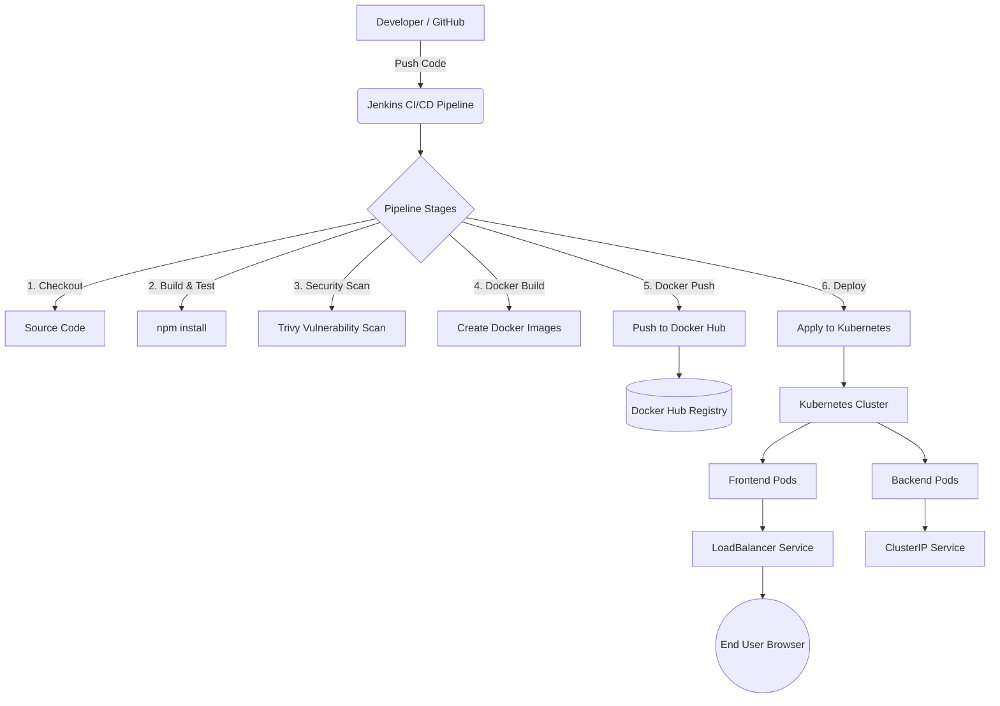

# Capstone Project: Smart Event Management Portal (DevOps Deployment)

**Project Scenario:**
A complete DevOps CI/CD pipeline deploying a containerized MERN stack application onto Kubernetes using Jenkins, designed for ABC Solutions Company

---

## 🏗️ Architecture Diagram
Below is the complete DevOps architecture implemented in this project:



---

## 🚀 Innovation Report (20 Marks)
As part of the Innovation Challenge, three advanced DevOps features have been implemented beyond the core requirements:

### 1. DevSecOps: Automated Container Security Scanning (Trivy)
*   **Why it was chosen:** Security is often an afterthought. Scanning images before they hit the registry ensures no critical vulnerabilities go to production.
*   **How it works:** Integrated `trivy image` scan in the Jenkins pipeline. If HIGH or CRITICAL vulnerabilities are found, the pipeline can be configured to halt.
*   **Benefits:** Proactive security, compliance, and reduced risk of production breaches.
*   **Challenges:** Managing cache locks during parallel scanning required optimizing the pipeline stages to use separate cache directories (`--cache-dir`).

### 2. Multi-Stage Docker Builds & Alpine Base Images
*   **Why it was chosen:** Standard Node.js images are very large (>1GB), leading to slow deployments and higher storage costs.
*   **How it works:** The Frontend `Dockerfile` uses a two-stage process. Stage 1 uses Node to build the React app. Stage 2 uses a lightweight `nginx:alpine` server to host the static files. The Backend uses `node:alpine`.
*   **Benefits:** Image sizes reduced by over 80%, resulting in lightning-fast pull times in Kubernetes and reduced attack surface.
*   **Challenges:** Configuring Nginx correctly inside the container to handle React Router's client-side routing.

### 3. True Zero-Downtime Deployments (Liveness/Readiness Probes)
*   **Why it was chosen:** "Zero downtime" is a core company expectation. Just using standard Kubernetes Deployments doesn't guarantee this if the app takes time to boot.
*   **How it works:** Added `livenessProbe` and `readinessProbe` to the Kubernetes deployment YAMLs. 
*   **Benefits:** Kubernetes will not send traffic to new Pods until they report as "ready", and it will automatically restart frozen Pods.
*   **Challenges:** Fine-tuning the `initialDelaySeconds` so Kubernetes doesn't kill the pod before it finishes connecting to the MongoDB database.

---

## 🛠️ Kubernetes Commands Used (Phase 3)

*   **Create Deployments:** `kubectl apply -f k8s/frontend-deployment.yaml`
*   **Create Services:** `kubectl apply -f k8s/backend-service.yaml`
*   **Scaling Replicas:** `kubectl scale deployment critter-frontend --replicas=3`
*   **Observe Pods:** `kubectl get pods -w`
*   **Rolling Update Status:** `kubectl rollout status deployment/critter-frontend`
*   **Rollback (Undo):** `kubectl rollout undo deployment/critter-frontend`
    *   *Why rollback is needed:* If a new version (v2) has a critical bug that wasn't caught in testing, a rollback instantly reverts the live application to the stable version (v1) to prevent user downtime.

---

## 📦 Docker Hub Links & Images (Phase 2)
*   Frontend Image: `bashar24k/eventportal-frontend`
*   Backend Image: `bashar24k/eventportal-backend`
*   **Image Versioning Strategy:** Images are tagged dynamically in the Jenkins pipeline using `${env.BUILD_ID}` (e.g., v1, v2, v3).

---

## ⚙️ Jenkins CI/CD Setup (Phase 4)
1. **GitHub Trigger:** Configured a Webhook in GitHub Settings targeting `<localtunnel-url>/github-webhook/`.
2. **Jenkins Pipeline:** The `Jenkinsfile` executes automatically on every `git push`.
3. **Automated Rollback:** If the `Verify Deployment` stage fails, the `post { failure { ... } }` block triggers `kubectl rollout undo` automatically.

---

## 💻 Local Development Setup (For Evaluation)
1.  **Clone Repo:** `git clone <repo-url>`
2.  **Environment Variables:** Create a `.env` file in the `server/` directory:
    ```env
    PORT=5000
    MONGODB_URI=your_mongodb_cluster_uri
    JWT_SECRET=your_jwt_secret
    ```
3.  **Run with Docker Compose:**
    ```bash
    docker-compose up --build
    ```